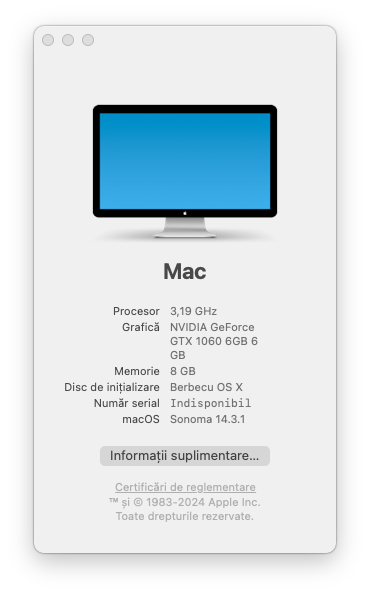

> ⚠️ It is recommended to check the config before using it, it could be specs specifi

</img>
# macOS Sonoma for Optiplex 3020

| CPU  | GPU  | Memory  | Storage    | Audio | Ethernet | SMBIOS |
| ---- | ---- | ------- | ---------- | --- | ------- | -- |
| i5-4590  | GTX 1060 6GB  | 8GB | Samsung 870 QVO | ALC280 | RTL8111 | iMacPro1,1 | 

An EFI made accordingly with the official opencore documentation. This EFI should be used as a pointer or a reference

## `ACPI/`

| -- | -- |
| ACPI | Description |
| SSDT-EC-DESKTOP.aml | Prebuilt ACPI, just works  |
| SSDT-PLUG-DRTNIA.aml | Prebuilt ACPI, just works  |

## `Drivers/`

| -- | -- |
| Drivers | Description |
| HfsPlus.efi | Driver for HFS  |
| OpenRuntime.efi | Opencore Functionality  |
| ResetNvramEntry.efi | Used for changing SIP   |
| XhciDxe.efi | USB3.0  |
| OpenCanopy.efi | Aesthetics  |

## `Kexts/`

| -- | -- |
| Kexts | Description |
| AppleALC | for audio i use alcid=17  |
| UTBMap & USBToolBox | Usb Mapping for the MT Version  |
| WhateverGreen | Graphics   |
| RealtekRTL8111 | Ethernet  |
| VirtualSMC & Others | Various SMC Drivers for basic functionality  |

# Possible Issues
Sleep and hibernation works, but when the system is woken up it is only a blackscreen and the cursor but when i enter the password it goes back to normal. I'll figure it out later

Since the cpu is older, might appear some lag spikes in the macos interface or whatever apps

# Nvidia
[1. Download OpenCore Legacy Patcher and simply click "Post-Install Root Patch"](https://github.com/dortania/OpenCore-Legacy-Patcher/releases)

1a. don't forget to set your sip in csr-active-config to 0xA03 ( 030a0000 ) and press space in the boot picker and reset the NVRAM.

2. In the `NVRAM -- 7C..82 -- boot-args` make sure you use `amfi_get_out_of_my_way=1 ipc_control_port_options=0  ngfxcompat=1 ngfxgl=1` it disables Metal and uses OpenGL instead.
3. 
`nvda_drv_vrl=1` -> it is only useful for High Sierra / Sierra, pointless on newer macos versions 

The guide is the same as https://github.com/varszegimarcell/Optiplex-3020-Hackintosh-OpenCore but i didn't have to configure the NVRAM variables, i used the default settings with SecureBoot disabled
